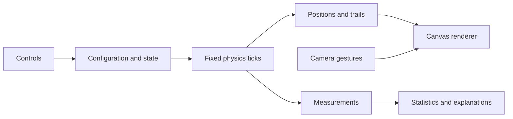

# Technical guide: how the pursuit simulation works

This guide describes the implementation in this repository. It is intended to help you explain the project during a demonstration or answer technical questions. The existing [README](README.md) covers installation and everyday controls.

## A short explanation you can give aloud

> This is a two-dimensional cyclic pursuit simulation. Drones start at the vertices of a regular polygon. Each drone moves at the same speed toward the next drone clockwise. The engine calculates every direction from a shared snapshot and advances the whole system numerically. A separate renderer converts meters into canvas pixels. The theoretical solution is used to predict meeting time and check accuracy, while the actual finite-polygon trajectories come from the pursuit equations.

## 1. What is being modeled?

This is a **kinematic model**: it prescribes velocity directly. It does not calculate motor thrust, mass, acceleration limits, aerodynamic drag, wind, sensor noise, or a flight controller. Drones can turn immediately to follow their targets. They are points in a plane rather than physical aircraft with collision shapes.

At every instant:

- Drone `i` targets drone `(i + 1) mod N`.
- Every drone has the same configured speed `v`.
- Direction changes continuously as the target moves.
- All drones evolve together; array order must not give any drone an advantage.

A good answer to “Is this realistic drone physics?” is: “It is an idealized pursuit model that isolates the geometry of chasing. Modeling actual flight dynamics would require additional constraints and forces.”

## 2. Where the code lives

| File | Responsibility |
| --- | --- |
| [src/simulation.ts](src/simulation.ts) | Physical configuration, drone coordinates, time, RK4 integration, trails and measurements |
| [src/renderer.ts](src/renderer.ts) | Canvas drawing, camera position, zoom and high-DPI sizing |
| [src/navigation.ts](src/navigation.ts) | Mouse, touch and keyboard camera gestures |
| [src/main.ts](src/main.ts) | DOM events, state transitions, translations, statistics and the animation loop |
| [src/i18n.ts](src/i18n.ts) | UI text, language selection and number formatting support |
| [src/polygon-names.ts](src/polygon-names.ts) | Explicit names for all 254 finite counts in three languages |
| [src/help.ts](src/help.ts) | Translated explanations and the native help dialog |
| [index.html](index.html), [src/main.css](src/main.css) | Page structure and presentation |

The simulation module has no DOM or canvas dependency. It can be reused in Project Kinetica by creating a `PursuitSimulation`, calling its methods and reading its arrays. The renderer and UI do not belong inside the physics engine.



## 3. Initial geometry and units

World positions are measured in **meters**, time in **seconds**, and speed in **meters per second**. Pixels appear only in rendering and pointer input.

For `N` sides, side length `s`, perimeter `P`, and circumradius `R₀`:

```text
P = N × s
s = P / N
R₀ = s / [2 sin(π/N)]
R₀ = P / [2N sin(π/N)]
```

Why the sine? Two neighboring vertices and the center form an isosceles triangle. Splitting it in half gives a right triangle whose opposite side is `s/2`, hypotenuse is `R₀`, and central half-angle is `π/N`.

Initial drone coordinates are:

```text
θᵢ = −π/2 + 2πi/N
xᵢ = R₀ cos(θᵢ)
yᵢ = R₀ sin(θᵢ)
```

The first vertex is at the top. This implementation uses positive y downward, matching canvas coordinates. Increasing the angle therefore moves clockwise on screen. The original geometric center is always `(0, 0)` in world coordinates, even when the camera moves.

The coordinate array is a `Float64Array` arranged as `[x₀, y₀, x₁, y₁, ...]`. Other typed arrays hold accumulated distances and RK4 working values. Initial positions are copied so the renderer can retain the original outline.

## 4. The pursuit equation

For drone `i`, define the vector to its target:

```text
j = (i + 1) mod N
dᵢ = position[j] − position[i]
velocity[i] = v × dᵢ / |dᵢ|
```

Dividing by the vector length produces a unit vector. Multiplying by `v` gives the same speed magnitude for every drone, regardless of how far away its target is.

The code calculates **all velocities from one position array** before modifying positions. This avoids a sequential-update error where later drones respond to coordinates that earlier drones have already changed.

If the direction length is at most `10⁻¹⁵`, the code uses zero for that velocity rather than dividing by a nearly zero number. Normal finite runs should terminate before the exact coincidence singularity becomes relevant.

## 5. Why RK4 is used

A simple Euler update would be `position += velocity × h`. It follows the current tangent for the whole step, which introduces noticeable error on curved paths, especially near the center.

This engine uses fourth-order Runge–Kutta, abbreviated **RK4**. Let `p` represent the entire position array and `f(p)` calculate all pursuit velocities:

```text
k₁ = f(p)
k₂ = f(p + h k₁/2)
k₃ = f(p + h k₂/2)
k₄ = f(p + h k₃)

p_new = p + h(k₁ + 2k₂ + 2k₃ + k₄)/6
```

Each stage recalculates directions from a complete intermediate snapshot. Intermediate snapshots are temporary estimates; they are not partial updates of the real drones. Only after the four stages does the engine commit the final displacement for every drone.

The instantaneous velocities at these stages have magnitude `v`. The length of the final displacement divided by `h` can be slightly below `v`, because a short chord is shorter than the corresponding curved path. This is one reason the numerical path measurement and `v × elapsedTime` are close rather than exactly identical.

RK4 improves accuracy for smooth motion. It does not remove floating-point error or make the singular meeting point safe without additional precautions.

## 6. Fixed ticks and smaller substeps

The outer physics tick is `1/240 s`. Inside a tick, the engine may take smaller substeps:

```text
expectedEdge = 2 × expectedRadius × sin(π/N)
h = min(remainingTickTime, 0.2 × expectedEdge / v)
```

That limits how far a drone can move relative to the estimated neighboring separation. As the polygon becomes small, the steps also become small. This helps prevent overshooting and instability in high-sided configurations.

There is a cap of **512 substeps per call** to prevent a pathological configuration from monopolizing the browser. If this cap is reached, the unprocessed part of that tick is not carried forward by the engine. Consequently, extreme configurations can advance slower than wall-clock time. The elapsed statistic still increases only by the time actually integrated.

The substep bound and termination use the theoretical regular-polygon radius. This implementation is designed for the regular, equal-speed setup. Supporting arbitrary initial positions, different speeds per drone or external disturbances would require revisiting those assumptions.

## 7. Browser animation and simulation time

`requestAnimationFrame` controls when the browser draws. It does not supply the physics timestep directly.

The UI keeps a time accumulator:

1. Measure the time since the previous frame.
2. Clamp it to at most `0.1 s`.
3. Add it to the accumulator only while running.
4. Consume whole `1/240 s` ticks while enough time remains.
5. Render the latest positions and schedule the next frame.

At 60 Hz, a normal frame contains roughly four physics ticks. At other refresh rates the number varies, but the physics tick stays the same. There is exactly one animation loop; Play never creates a second loop.

Pause stops physics updates and elapsed-time accumulation. The rendering loop remains alive so camera navigation and visual changes still work. Play/Pause clears the last-frame timestamp to prevent counting the pause interval. A visibility change also clears that timestamp and the accumulator, so returning from a background tab does not fast-forward hidden time.

Positions are rendered from the most recent integrated state; there is no extra interpolation between physics snapshots. Ordinary statistics refresh about ten times per second, with immediate updates for relevant control actions.

## 8. Why the drones spiral inward

For a regular polygon, the direction toward the next vertex is tilted inward from the tangent by `α = π/N`. Resolving velocity into radial and tangential components gives:

```text
inward radial speed = v sin(α)
tangential speed = v cos(α)
dR/dt = −v sin(α)
```

At constant speed, radial motion integrates to:

```text
R(t) = R₀ − v sin(π/N)t
T = R₀ / [v sin(π/N)]
T = s / [2v sin²(π/N)]
```

The tangential speed rotates the polygon while the radius decreases. More specifically, with the screen's clockwise angle convention:

```text
dθ/dt = v cos(α) / R
dR/dθ = −R tan(α)
R = R₀ exp[−tan(α)(θ − θ₀)]
```

This is the equation of a logarithmic spiral. The ideal solution winds infinitely many times as it approaches the meeting point; the implementation ends at a small tolerance instead.

**Example using the default square:** `N = 4`, side `s = 20 m`, speed `v = 2 m/s`.

```text
R₀ ≈ 14.1421 m
radial speed ≈ 1.4142 m/s
meeting time = 10 s
```

After 3 simulated seconds, the predicted radius is about `9.8995 m`, neighboring drones are `14 m` apart, and each drone has travelled about `6 m`.

The actual finite-polygon positions are produced by the RK4 pursuit updates. The analytical expressions provide predictions, step-size guidance and a termination criterion; they do not prescribe the displayed spiral coordinates.

## 9. Quasi-orbit versus ideal Circle

For every finite `N`, `sin(π/N)` is positive. A high-sided polygon still moves inward. The UI uses **Quasi-orbit** when this radial fraction is below `0.05`; it is a descriptive threshold, not a phase transition to a permanent orbit.

Circle mode is explicitly separate. It uses 64 rendered samples but models an ideal circle with:

```text
R = P/(2π)
radial speed = 0
tangential speed = v
angular speed ω = v/R
meeting time = Infinity
```

Each circle step rotates the coordinates using the usual rotation matrix with angle `ωh`. This is an exact circular update in real arithmetic, subject to normal floating-point roundoff. It is not finite cyclic pursuit between those 64 samples.

When comparing large polygons, specify what size is fixed. At fixed perimeter, `R₀` tends to `P/(2π)` and meeting time grows approximately linearly with `N`. At fixed side length, `R₀` itself grows with `N`, and meeting time grows approximately as `N²`. Those are different comparisons.

## 10. Speed changes and completion

`commandedDistance` accumulates `v × h` for each integrated substep. It represents `∫v dt`, so speed changes can be handled without pretending the new speed applied to the entire past run.

```text
expectedRadius = max(0, R₀ − commandedDistance × sin(π/N))
predictedMeetingTime = elapsed + expectedRadius / [currentSpeed × sin(π/N)]
```

The meeting statistic is total predicted time from the start, not a countdown. It assumes the current speed continues.

For a finite polygon, completion occurs when the expected radius is at most:

```text
epsilon = min(10⁻⁵ m, R₀ × 10⁻⁵)
```

The engine then puts every drone at the center, sets `COMPLETE`, records the terminal trail point when trails are enabled, and stops integrating. The final tiny snap is not added to travelled distance. Completion is slightly before the exact theoretical meeting time because it uses a tolerance.

This criterion is suitable for the symmetric regular case. It does not independently prove that a disturbed or arbitrary configuration has numerically converged.

## 11. State and reset behavior

| Action | Effect |
| --- | --- |
| Play from INITIAL | Start the existing initial configuration |
| Pause while RUNNING | Preserve positions, time, distances and trails |
| Play while PAUSED | Continue the same simulation object |
| Stop | Construct a fresh simulation from the current configuration |
| Play after COMPLETE | Reset, then start a new run |
| Change shape, size or measurement mode | Reset safely |
| Change speed | Apply immediately; preserve current positions and time |
| Change language, visual options or camera | Preserve physics |
| Center | Recenter the camera and restore automatic fitting |

Reset also clears the accumulator and last-frame timestamp. The UI restores the Play icon, removes `.stop-btn.appear`, and removes `.placeholder.expanded`. Those existing CSS classes control the Stop reveal and control spacing.

Changing measurement mode converts side length to perimeter or back to preserve the physical size before rebuilding. Entering Circle converts a side-based size to circumference. The circle radius then uses the ideal circumference formula, which is slightly different from the finite polygon's circumradius.

## 12. Canvas and camera mathematics

**Off-center navigation is disabled by default.** The camera stays at world `(0, 0)`: wheel, pinch and slider zoom keep a fixed center, while drag and arrow-key panning are ignored. Enabling the toggle permits the pointer-anchored zoom and free panning described below.

`renderer.setOffCenter(false)` returns the camera to `(0, 0)` without changing the zoom level or Auto zoom setting. `zoomAt()` then routes zoom directly through `setManualZoom()` rather than moving the camera to preserve a cursor anchor, and `pan()` returns without changing anything. These checks live in the renderer, so mouse, touch and keyboard all obey the same rule. The toggle never resets physics. Center, Home and double-click still restore centered auto fitting and leave the off-center preference unchanged.

The camera stores its center in world meters, independently of the drone array. With scale `S` in CSS pixels per meter:

```text
screenX = viewportWidth/2  + (worldX − cameraX) × S
screenY = viewportHeight/2 + (worldY − cameraY) × S
```

The inverse transform is:

```text
worldX = cameraX + (screenX − viewportWidth/2) / S
worldY = cameraY + (screenY − viewportHeight/2) / S
```

For pointer-anchored zoom, the renderer first calculates the world point under the cursor. After changing scale, it adjusts the camera so that the same world point maps back to the same screen coordinate. Panning subtracts `dragDistance / S` from the camera position.

The slider uses a logarithmic scale: `zoomMultiplier = 10^sliderValue`. This makes a large zoom range manageable. Its zoom center is the current camera center, so it also works after panning.

Auto zoom measures the largest current drone radius. The available screen radius is approximately `0.40 × min(width, height) − 4 pixels`, leaving about 10% padding on the shorter dimension. Scale is based on live drones, not old trails or the initial outline. Its logarithmic smoothing is constrained to stay within 5% below the target scale. Following radius rather than a rotating rectangular bounding box avoids rotation-induced pulsing.

The **Center** button calls `renderer.setAutoZoom(true)`. This sets the camera coordinates to zero and requests a fresh fit. Its handler redraws and synchronizes the auto-zoom checkbox and zoom output; it never calls the simulation's reset function. It therefore works while paused without resuming the run.

Normal completion freezes the current automatic scale. An explicit Center action requests a new fit; when all positions are zero, the renderer's minimum fitting radius prevents division by zero. Very large zoom values at this terminal point are a camera guard, not a physical radius measurement.

For high-DPI screens, the canvas backing dimensions are `CSS size × devicePixelRatio`. The context transform accounts for the pixel ratio while drawing coordinates remain in CSS pixels. Resizing updates the canvas and camera scale, not world positions.

## 13. Trails, memory and computational cost

Every drone has a ring buffer with 1,024 pairs of 64-bit coordinates. Adding a point overwrites the oldest point once the buffer is full. This avoids both unlimited memory growth and shifting a long array for every new sample.

At 256 drones, the coordinate storage for trails is:

```text
256 × 1,024 × 2 × 8 bytes = 4,194,304 bytes = 4 MiB
```

That excludes object overhead and the much smaller physics arrays. Normal trail recording is limited to roughly 30 samples per simulated second, plus initial and terminal samples. Disabling trails stops recording; Stop clears them by creating a new simulation.

Each velocity evaluation is `O(N)`, and RK4 uses four evaluations per substep. Physics cost is therefore `O(N × substeps)`. Drawing trails can cost `O(N × historyLength)`, although history is bounded. There is no DOM element per drone: all drones and trails are canvas drawing commands.

## 14. What the statistics establish

The measurements use averages across drones:

- Radius: average `|position[i]|` from the original center.
- Neighbor distance: average `|position[next] − position[i]|`.
- Travelled: average accumulated numerical displacement length per drone.
- Radius error: `100 × |averageRadius − expectedRadius| / R₀`.
- Path error: absolute difference between average travelled distance and `commandedDistance`.
- Radius and neighbor spreads: maximum minus minimum across the group.

Normalizing radius error by `R₀` avoids an undefined relative error when the expected final radius is zero. Small spreads support preservation of regular symmetry, while path error checks agreement with prescribed speed. A displayed `0.0000%` means rounded-to-zero, not mathematically exact.

## 15. Languages, help and names

The default language is English. Russian and Romanian use the same translation keys, checked by TypeScript. The selected language is stored in `localStorage` when available. Switching language changes text, accessible labels and number formatting; it does not reconstruct the simulation.

The `(?)` buttons use a native HTML dialog. Help is translated and state-aware: the state explanation can describe a finite quasi-orbit or the ideal Circle separately. Opening help does not pause physics automatically.

Polygon names are a static table, not generated by the physics engine. Long names follow one localized Greek-prefix convention; alternative spellings exist. The numeric side count remains alongside the name, so the physical configuration is unambiguous.

## 16. Validation and its limits

Run:

```sh
bun test
bun --bun run build
```

The tests cover selected finite counts `3, 4, 8, 64, 256`, radial-law agreement, symmetry spreads, completion time, path length, pause/resume, live speed changes, circle stability, bounded history, and a tiny high-speed configuration. Camera tests cover anchored zoom, panning, gestures, recentering and unchanged physical coordinates. A lightweight DOM harness checks UI transitions, translations, help and the Center button. The production build runs TypeScript checking before Vite bundling.

For the tested regular-polygon runs, assertions require radius error below `0.02%` of the initial radius, normalized radius/neighbor spreads below `10⁻⁵`, relative meeting-time difference below `10⁻⁴`, and relative path discrepancy below `0.005`. These are test tolerances for those scenarios, not a proof of those bounds for every possible input.

The DOM/canvas harness does not verify browser layout, visual polish or every device gesture implementation. Numerical tests are evidence of behavior within their scope, not a substitute for a browser review or a general mathematical proof.

## Questions you may be asked

**Why do all drones have to update simultaneously?**  
Otherwise the result depends on array order. Shared snapshots make every drone respond to the same simulated instant.

**Why not just use the exact spiral formula?**  
The goal is to simulate the pursuit rule. The exact regular-case solution is a useful independent reference for checking the numerical result. The current engine still uses that theory to bound substeps and decide completion, so it is not yet a general arbitrary-configuration solver.

**Does changing the display refresh rate change the physics?**  
Ordinary rendering changes how often positions are drawn, not the fixed physics tick. Frame clamping, background handling and the extreme-work cap intentionally prevent unlimited catch-up, so simulation time is not guaranteed to equal wall time.

**Why is the polygon still large on screen near the end?**  
Auto zoom increases pixels per meter as physical radius shrinks. Read the radius statistic or turn off auto zoom to compare sizes at a fixed camera scale.

**Why does a finite high-sided polygon eventually meet?**  
Its inward speed is `v sin(π/N)`, which remains positive for every finite N. A small positive speed can look almost stationary radially, but it is not zero.

**Are the 64 Circle samples chasing each other?**  
No. Circle is an explicit ideal-limit mode using rotation at constant radius. If those samples chased their neighbors as a finite 64-gon, they would converge.

**Why can simulated travelled distance differ from speed times time?**  
The finite solver accumulates short numerical displacement lengths along a curve. Their sum approximates the continuous path; variable speed also requires integrating speed over time instead of multiplying the latest speed by the entire elapsed time.

**Does Center move the drones?**  
No. It changes only the camera and enables auto fitting. The drone arrays, elapsed time and run state stay intact.

**What would you change to simulate real aircraft?**  
Add orientation, bounded turn rate or acceleration, a controller, physical forces, sensing delays and collision handling. Then rework the regular-case step bound and completion logic, since the symmetric analytical formulas would no longer necessarily apply.

